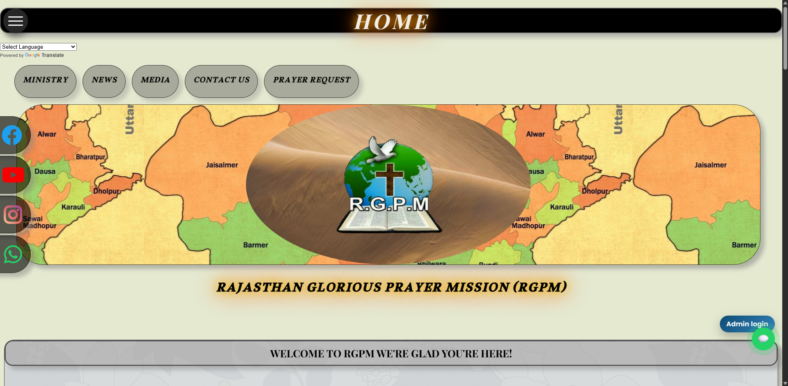
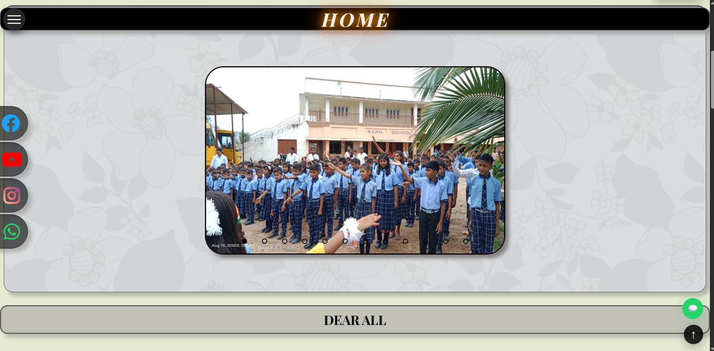
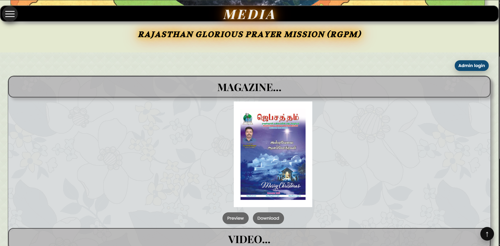

 🌐 RGPM Website (Full-Stack Pro-Bono Project)

 📌 Overview

This project is a fully functional full-stack website developed and maintained for Rajasthan Glorious Prayer Mission (RGPM) as a pro-bono initiative.

The platform improves community engagement, accessibility, and provides a modern digital presence.

🔗 Live Website: https://rajasthangloriousprayermission.org/

---

📁 Backend

The backend implementation for this project is available here:

🔗 https://drive.google.com/drive/folders/1JT_RbTKn4M_nkadJJoBqu58gb7CD9Tie?usp=sharing

It contains the server-side code built using Node.js and Express.
Environment variables and large media files are excluded for security and efficiency.

---

 🚀 Features

* Responsive web design (mobile & desktop)
* Admin portal for content management
* Secure admin-only access
* Dynamic updates for photos, videos, and news
* Google Forms integration for prayer requests
* Optimized performance and fast loading
* User-friendly interface

---

 🔐 Admin Panel

The system includes a secure admin dashboard that allows:

* Uploading and managing images and media
* Posting and updating news and announcements
* Maintaining website content dynamically

Access is restricted to authorized admin users only.

---

 🛠️ Tech Stack

 Frontend:

* Next.js (React)
* HTML, CSS, JavaScript

 Backend:

* Node.js (Express)
* Hosted on Railway

 Database:

* MongoDB 

---

 ☁️ Deployment

* Backend deployed using Railway
* Frontend deployed on live domain
* Production-level deployment and maintenance

---

 🌍 Real-World Usage

The website is actively used by RGPM for:

* Publishing updates and announcements
* Sharing media and ministry content
* Collecting prayer requests via Google Forms

The system is currently maintained in a live production environment.

---

 📷 Screenshots

  

  

  

---

 👨‍💻 My Contribution

* Designed and developed the full-stack application
* Built responsive UI using Next.js
* Developed admin panel for content management
* Integrated backend services and APIs
* Deployed backend using Railway
* Managed hosting and live updates

---

 ⚠️ Note

Large media files (audio, video, and other heavy assets) are excluded from this repository to maintain optimal size and performance. The live website contains full media content.

---

## 📬 Contact

Name: Sam Good Win A
📧 Email: [asamgoodwin@gmail.com](mailto:asamgoodwin@gmail.com)
🌐 Website: https://rajasthangloriousprayermission.org/
💼 GitHub: https://github.com/SamgoodwinA
